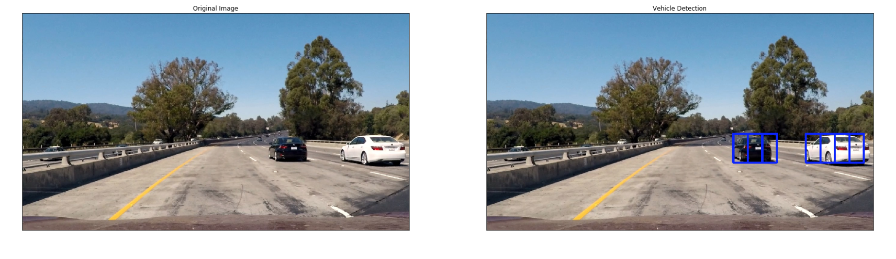
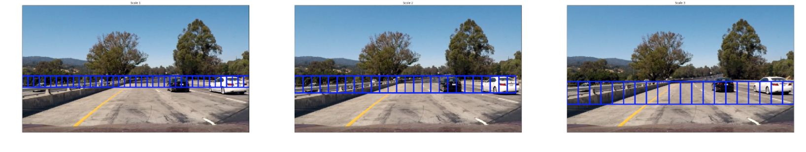
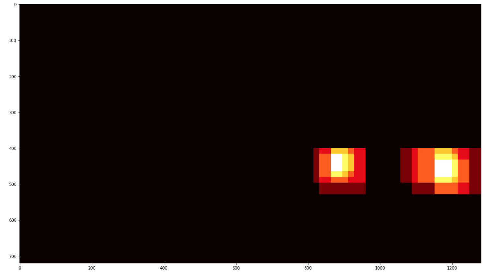

# Vehicle Detection

---

**Vehicle Detection Project**

The goals / steps of this project are the following:

* Perform a Histogram of Oriented Gradients (HOG) feature extraction on a labeled training set of images and train a classifier Linear SVM classifier
* Optionally, you can also apply a color transform and append binned color features, as well as histograms of color, to your HOG feature vector. 
* Note: for those first two steps don't forget to normalize your features and randomize a selection for training and testing.
* Implement a sliding-window technique and use your trained classifier to search for vehicles in images.
* Run your pipeline on a video stream (start with the test_video.mp4 and later implement on full project_video.mp4) and create a heat map of recurring detections frame by frame to reject outliers and follow detected vehicles.
* Estimate a bounding box for vehicles detected.

## [Rubric](https://review.udacity.com/#!/rubrics/513/view) Points
### Here I will consider the rubric points individually and describe how I addressed each point in my implementation.  

---
### Writeup / README

#### 1. Provide a Writeup / README that includes all the rubric points and how you addressed each one.  You can submit your writeup as markdown or pdf.  [Here](https://github.com/udacity/CarND-Vehicle-Detection/blob/master/writeup_template.md) is a template writeup for this project you can use as a guide and a starting point.  

You're reading it!
Code for the project is in the Jupyter notebook project4.ipynb

### Histogram of Oriented Gradients (HOG)

#### 1. Explain how (and identify where in your code) you extracted HOG features from the training images.

Project conatins 2 datasets `vehicle` and `non-vehicle` images on which we will be extracting the Hog, color, spacial features to train the model in identifying the cars.  Sample dataset images containing car and non cars are below:
 

The code for the extratcing  features is contained in the 8th code cell of the IPython notebook (defined in 'extract_features' function) . Based on the flags spatial, color and HOG features were extracted. 

Code for extracting HOG features was defined in 5th code cell. I then explored different color spaces and different `skimage.hog()` parameters (`orientations`, `pixels_per_cell`, and `cells_per_block`).  I grabbed random images from each of the two classes and displayed them to get a feel for what the `skimage.hog()` output looks like.

 

#### 2. Explain how you settled on your final choice of HOG parameters.

Here is an example using the `YUV` color space and HOG parameters:
  * color_space = 'YUV'
  * spatial_size=(32, 32)
  * hist_bins=32
  * orient = 11
  * pix_per_cell = 16
  * cell_per_block = 2
  * hog_channel='ALL'

Final choice of HOG parameters were based on the performance of the SVM classifier predictions and the speed at which the classifier is able to make predictions.

#### 3. Describe how (and identify where in your code) you trained a classifier using your selected HOG features (and color features if you used them).
I trained the the linear SVM with the default classifier parameters and passing HOG, spatial and color channel features. I was able to acheive a test accuracy of 

### Sliding Window Search

#### 1. Describe how (and identify where in your code) you implemented a sliding window search.  How did you decide what scales to search and how much to overlap windows?

I implemented a sliding window search using the find_cars function in the notebook. This function was adapted from the lesson material.
This method instead of extracting HG features individually on each window it does extract on entire/part of the image. These full-image features are subsampled according to the size of the window and then fed to the classifier. 

This method performs the prediction based on the fed HOG features and returns list of rectangle windows drawn on to the positive predictions.

The image below shows the first attempt at using find_cars on one of the test images, using a single window size:

 

I explored several options with multiple scales and window positions(y start and stop positions), with various overlaps in the X and Y directions.

The images below show the multiscale sliding window search by taking different scales, small (1x), medium (1.5x, 2x), and large (3x) windows: 
 
 

Below image with multiple bounding boxes reports positive detections. But we can notice that multiple overlapping detections exist for each of the two vehicles. 
 

To remove the duplicate detections and false positives , we will build a heat-map and thresholdfrom these detections in order to combine overlapping detections and remove false positives.The 'add_heat' function increments the pixel value (referred to as "heat") to (+=1) for all pixels within windows where a positive detection are reported by the classifier. The below image is the resulting heatmap from the detections in the image above:
 

A threshold is applied to the heatmap to reject the false positives. The result is below:
 

To figure out how many cars are in each frame and which pixels belong to which cars,scipy.ndimage.measurements.label() function was called.
 

#### 2. Show some examples of test images to demonstrate how your pipeline is working.  What did you do to optimize the performance of your classifier?

Some example images to demonstate pipeline is working:

 
---
The final implementation performs very well, identifying the cars in each of the frames with no false positives.

The original classifier used HOG features alone and achieved a test accuracy of 96.28%. I added spatial and color features to the original hog features and changed the channel to YUV channels whihc increased the accuracy to 98.40%,with a cost of increase in execution time. However, changing the pixels_per_cell parameter from 8 to 16 produced a roughly ten-fold increase in execution speed with minimal cost to accuracy.

### Video Implementation

#### 1. Provide a link to your final video output.  Your pipeline should perform reasonably well on the entire project video (somewhat wobbly or unstable bounding boxes are ok as long as you are identifying the vehicles most of the time with minimal false positives.)
Here's a [link to my video result](./project_video_out.mp4)

#### 2. Describe how (and identify where in your code) you implemented some kind of filter for false positives and some method for combining overlapping bounding boxes.

The code for processing frames of video is identical to the code for processing a single image, except it stores the detections of the vehicles returned by find_cars  This is defined in the class Vehicle_Detect, where add_rects, stores only last 12 frames and filters rest. Instead of performing the heatmap on the current frame's detections, the detections was done for the past 12 frames and the results are combined and added to the heatmap and the threshold. I used `scipy.ndimage.measurements.label()` to identify individual blobs in the heatmap and corresponded each blob to a car. 

### Discussion

#### 1. Briefly discuss any problems / issues you faced in your implementation of this project.  Where will your pipeline likely fail?  What could you do to make it more robust?

Problems:
  * Accuracy detection.
  * Speed of execution
  * False positives
 The above first two where the most challenging factors of this project. Having high accuracy with less execution time was quite challenging, these could be soloved with more intelligent tracking strategies.
 
Even after optimizimg the code by processing and storing previous frames, still false positives were identified. This could be because of the vehicle positions changed significantly from one frame to the other and there was oncoming traffic and distance cars. These problems may be can be removed with high accuracy classifiers or using deep neural nets which can be done as future step.

Pipeline Failure: 

   * lighting and environmental conditions might also play a role  
   * oncoming cars are an issue, as well as distant cars as smaller window scales are likely to have more false positives

